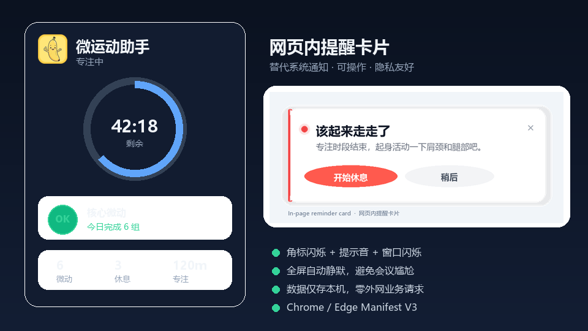
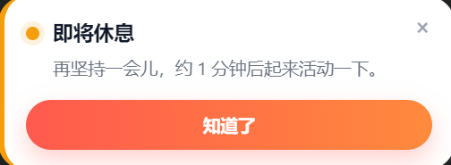
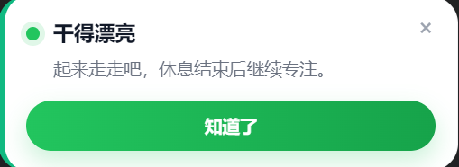

# 防久坐 · 微运动助手 / Anti-Sedentary Micro-Motion Assistant

[English](#english) | [中文](#中文)

轻量级 Chrome / Edge **Manifest V3** 浏览器扩展。  
双核状态机：久坐打断 + 高频微动（中性文案），数据全部本地存储。

A lightweight Chrome / Edge **Manifest V3** extension.  
Dual-core timers: sit-break + micro-motion reminders. Privacy-first, all data stays local.

<p align="center">
  
</p>

---

## 中文

### 功能

| 能力 | 说明 |
|------|------|
| 久坐计时 | 专注 → 预警 → 该休息 → 超时紧急 → 休息 → 再专注 |
| 三阶提醒 | 角标闪烁 → **网页内卡片** → 提示音 / 窗口闪烁 |
| 微动循环 | 独立闹钟动态续期；点击 🌱 手动打卡 |
| 全屏静默 | 检测全屏，自动暂停微动提醒 |
| 自定义音效 | 内置多风格 + 上传本地音频 |
| 检查更新 | 弹窗底部「项目主页 / 检查更新」 |

### 界面预览

#### 总览

弹窗控制面板 + 网页内提醒卡片（替代系统通知）：

<p align="center">
  
</p>

#### 提醒卡片示例

不使用系统通知，统一用网页右下角可操作卡片。全屏时自动隐藏，避免会议尴尬。

| 场景 | 预览 |
|------|------|
| **即将休息**（预警） |  |
| **该起来走走了**（休息提醒） |  |
| **微运动**（核心收紧） |  |
| **干得漂亮**（开始休息鼓励） |  |

卡片说明：

- **即将休息**：黄点 +「知道了」—— 提前 1 分钟心理准备
- **该起来走走了**：红点 +「开始休息 / 稍后」—— 专注时段结束
- **微运动**：绿点 +「做完了 / 稍后」—— 中性文案，防社死
- **干得漂亮**：绿点 +「知道了」—— 开始休息后的鼓励反馈
- **超时紧急**：脉冲高亮，约每 2 分钟复响，直到你点开始休息

### 安装（开发者模式）

1. 打开 `chrome://extensions` 或 `edge://extensions`
2. 开启 **开发者模式**
3. **加载已解压的扩展程序** → 选择本仓库根目录（含 `manifest.json` 的目录）
4. 点击工具栏图标打开控制面板

### 调试加速

在 [`src/shared/constants.js`](src/shared/constants.js) 中：

```js
export const DEBUG_MODE = true; // 将「分钟」压缩为秒级，便于走完状态流转
```

改完后到扩展页点击「重新加载」。

### 配置项目链接 / 更新检查

仓库地址已配置为：

```js
export const PROJECT_REPO = 'mfcer110/anti-sedentary-assistant';
```

如 fork 到自己的账号，请改成你的 `用户名/仓库名`。

### 权限说明

| 权限 | 用途 |
|------|------|
| `storage` | 本地保存设置与状态 |
| `alarms` | Service Worker 休眠后仍能唤醒计时 |
| `offscreen` | 短时播放提示音 |
| `idle` | 系统空闲检测 |
| `windows` | 紧急时任务栏窗口闪烁 |
| `api.github.com` / `raw.githubusercontent.com` | 仅用于「检查更新」 |

Content Script 只做活跃度 / 全屏检测与页面内提醒卡片，**不读取页面业务内容**。

### 技术要点

- Vanilla JS ES Modules，无需构建
- SitTimer / KegelTimer 解耦调度
- storage 内存镜像 + 节流落盘
- 墙钟时间校准，打开弹窗不会错误重置倒计时
- Offscreen 按需创建、用完即毁

更完整的设计见 [`ARCHITECTURE.md`](ARCHITECTURE.md)。

---

## English

### Features

| Feature | Description |
|---------|-------------|
| Sit timer | Focus → warn → break pending → urgent → rest → focus |
| Tiered alerts | Badge blink → **in-page card** → sound / window flash |
| Micro-motion loop | Independent alarm; click 🌱 to log a set |
| Fullscreen mute | Auto-suppress micro-motion during fullscreen |
| Custom sounds | Built-in styles + upload local audio |
| Update check | Footer links: Project / Check for updates |

### Screenshots

#### Overview

Popup panel + in-page reminder card (replaces system notifications):

<p align="center">
  
</p>

#### Reminder card gallery

No system notifications. All alerts use an actionable bottom-right page card. Cards auto-hide in fullscreen to avoid meeting awkwardness.

| Scene | Preview |
|-------|---------|
| **Almost time for a break** |  |
| **Time to stand up** |  |
| **Micro-motion** |  |
| **Nice work** |  |

Card notes:

- **Warn**: amber accent + Got it — 1 minute heads-up
- **Break due**: red accent + Start break / Later
- **Micro-motion**: green accent + Done / Later — neutral copy
- **Success**: green accent + Got it — after you start resting
- **Overdue**: pulse highlight + nudge every ~2 minutes until you start a break

### Install (developer mode)

1. Open `chrome://extensions` or `edge://extensions`
2. Enable **Developer mode**
3. **Load unpacked** → select this repository root (the folder with `manifest.json`)
4. Click the toolbar icon to open the popup

### Fast debug

In [`src/shared/constants.js`](src/shared/constants.js):

```js
export const DEBUG_MODE = true; // compress minutes to seconds for quick flow testing
```

Then reload the extension.

### Project URL / update check

```js
export const PROJECT_REPO = 'mfcer110/anti-sedentary-assistant';
```

If you fork, point this to your own `username/repo`.

### Permissions

| Permission | Purpose |
|------------|---------|
| `storage` | Local settings & state |
| `alarms` | Wake the service worker on schedule |
| `offscreen` | Short private alert tones |
| `idle` | System idle detection |
| `windows` | Taskbar attention flash when overdue |
| GitHub hosts | **Only** for “Check for updates” |

The content script never reads page business data — only activity / fullscreen + the reminder card UI.

### Architecture highlights

- Vanilla JS ES modules (no bundler)
- Decoupled SitTimer / KegelTimer
- In-memory storage mirror with throttled writes
- Wall-clock sync so opening the popup does not reset the timer
- On-demand offscreen document for audio

See [`ARCHITECTURE.md`](ARCHITECTURE.md) for details.

---

## License

MIT
